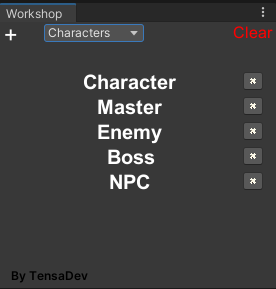

# Workshop
A Drag and Drop Unity Editor Tool to quickly select GameObjects instead of the Hierarchy default Inspector

# How To Use
- You can Drag GameObjects you're Using in Workshop from the Hierarchy
- You can write only the Exact Name of the GameObject (if it's short but takes time to find) and hit Enter

# How to Create a Save
- Preferably, go to Workshop/Editor/Saves in Project Tab, right click and hit Workshop -> New Save

ps: If you have 2 GameObjects with same name Only the First One in the Hierarchy will be shown in Workshop.
